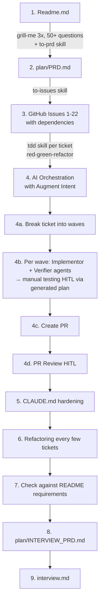

# Interviewer Readme

This coding challenge was solved end-to-end with AI using a structuredHuman-in-the-Loop (HITL) approach: PRD grilling → ticketed TDD → manualverification → review.

This document covers:

1. **How to verify each of the six README requirements** — one shellscript (and one npm command) per happy/sad path, plus rationale filesthat explain what each script proves.
2. **The pragmatic design decisions** made along the way, eachdocumenting the chosen *challenge-scope* solution alongside the*production-grade* alternative.

## 1. Orientation

| Path | Purpose |
| --- | --- |
| Readme.md | Original challenge brief (unmodified). |
| plan/PRD.md | Locked product spec — every requirement and assumption pinned with a production-grade alternative. |
| plan/INTERVIEW_PRD.md | Meta-spec for this document. |
| interview/manual_test_plan/ | Shell scripts (happy + sad per requirement) and rationale .md files. The verification surface for §3. |
| interview/archive/ | Long-form rationale and pre-rebuild material. Linked from §4 design decisions. |
| tests/ | Vitest suite (135 tests), one folder per README requirement. |
| npm run manual-test:all | Run every happy + sad shell script sequentially. Per-script commands also exist (see §3). |
| npm test | Run the full Vitest suite. |

## 2. Process

GitHub issues: [hancrafted/async-worfklow-backend-challenge/issues](https://github.com/hancrafted/async-worfklow-backend-challenge/issues).

## 3. Verification

> Prerequisite: sudo apt-get update && sudo apt-get install -y sqlite3if sqlite3 is not present (e.g. codesandbox).

The verification surface lives in `interview/manual_test_plan/`:

1. One happy script per README requirement.
2. One sad script per requirement, except §03a — its sad-path coveragelives in `tests/03-interdependent-tasks/`.
3. Six rationale `.md` files explaining *what each script proves* and*what to look for in the output*, without restating thecurl/sqlite/jq plumbing.
4. All scripts source `_lib.sh` for shared helpers (`require_server`,`post_analysis`, `wait_terminal`, `assert_*`, `summarize`, fixtures).

**Script contract** (locked in `plan/INTERVIEW_PRD.md` Round-10 grill):

- Each assertion prints `[PASS]` or `[FAIL]` plus the evidence checked.Scripts end with `summarize` and exit non-zero on any failure, givinga one-glance batch verdict.
- **Two-terminal pattern** (Q6) — Terminal A runs `npm start`; TerminalB runs the script(s). No script manages server lifecycle. Unreachable`:3000` triggers an actionable error from `_lib.sh::require_server`.
- **WorkflowId-scoped hermeticity** (Q7) — each script captures its own`$WORKFLOW_ID` and filters every SQL/HTTP assertion by it. Sad scriptsthat mutate the DB revert via `trap EXIT`. No global counts; scriptsrun in any order against a shared server.

**Running the scripts via npm.** Each shell script is wired as an npmscript for convenience:

- `npm run manual-test:all` — run every happy + sad script sequentially.
- `npm run manual-test:NN-<name>:happy` / `:sad` — run one script. Forexample: `npm run manual-test:01-polygon-area:happy`.

Direct `bash interview/manual_test_plan/<script>.sh` invocation alsoworks. See `package.json` `scripts` for the full list.

| README req | Rationale | Happy | Sad | What it asserts |
| --- | --- | --- | --- | --- |
| §1 PolygonAreaJob | 01_polygon-area.md | 01_polygon-area_happy.sh | 01_polygon-area_sad.sh | Job calculates @turf/area and persists it on Result.data keyed off Task.resultId (happy); malformed GeoJSON marks the task failed with structured Result.error and a stack truncated to ≤10 lines (sad). |
| §2 ReportGenerationJob | 02_report-generation.md | 02_report-generation_happy.sh | 02_report-generation_sad.sh | Report aggregates upstream outputs into { workflowId, tasks[{stepNumber,taskType,output}], finalReport } with no taskId in the payload (happy); a corrupted upstream Result.data row makes the report job fail without breaking the workflow's terminal write (sad). |
| §3 Workflow YAML dependsOn | 03a_workflow-yaml-dependson.md | 03a_workflow-yaml-dependson_happy.sh | — see tests/03-interdependent-tasks/ | Workflow created from a multi-step YAML resolves dependsOn step numbers to UUIDs in a single transactional save; dependents stay waiting until parents complete. Sad-path validation (cycles, self-deps, missing refs, duplicate stepNumbers) is asserted by the integration suite. |
| §4 Workflow.finalResult | 04_workflow-final-result.md | 04_workflow-final-result_happy.sh | 04_workflow-final-result_sad.sh | finalResult is written eagerly inside the post-task transaction that takes the workflow terminal, with { workflowId, tasks[], failedAtStep? } shape and the conditional-UPDATE idempotency guard (happy); a failing first task closes the workflow as failed and finalResult.failedAtStep matches the failing step (sad). |
| §5 GET /workflow/:id/status | 05_workflow-status.md | 05_workflow-status_happy.sh | 05_workflow-status_sad.sh | Status response carries { workflowId, status, completedTasks, totalTasks, tasks[{stepNumber,taskType,status,dependsOn,failureReason?}] }; dependsOn is translated from internal UUIDs to public stepNumbers (happy); unknown id returns 404 { error: "WORKFLOW_NOT_FOUND" } (sad). |
| §6 GET /workflow/:id/results | 06_workflow-results.md | 06_workflow-results_happy.sh | 06_workflow-results_sad.sh | Completed workflow returns 200 { workflowId, status:"completed", finalResult } with the lazy-patch path covered if finalResult IS NULL at read time (happy); failed terminal returns 400 { error: "WORKFLOW_FAILED" } per Issue #22 strict policy and unknown id returns 404 (sad). |

For deeper plumbing — fixtures, helper signatures, archived per-tasknotes — see `interview/manual_test_plan/README.md`.

## 4. Design decisions

The six entries below are the calls most likely to draw pushback. Eachcovers *what was done* / *why* / *production-grade alternative*.Complete trade-off bookkeeping (every per-task call) lives in`interview/archive/design_decisions.md`,with long-form rebuttals alongside.

### 4.1 No lease, no heartbeat on `in_progress` tasks (Tier A)

**What.** The atomic claim is a single `UPDATE tasks SET status = 'in_progress' WHERE taskId = ? AND status = 'queued'`. No `claimedAt`,no `leaseExpiresAt`, no heartbeat goroutine, no boot-time recoverysweep.

**Why.** The DB is reset on every boot (`synchronize: true` against awiped file), so no stale `in_progress` rows exist to recover. The atomicclaim plus per-job timeouts suffices at this scope. A lease without aheartbeat ages into the same problem — a stale row gets re-claimed byanother worker mid-execution — without buying anything. Full four-layerrebuttal in`interview/archive/no-lease-and-heartbeat.md`.

**Production-grade.** Persistent DB + TypeORM migrations + boot-timerecovery sweep resetting stale `in_progress` rows older than the workerheartbeat back to `queued`.

### 4.2 Worker-pool default journey: 3 → 1 → 3 (Tier A)

**What.** `DEFAULT_WORKER_POOL_SIZE` evolved across three steps:

1. Shipped at original default of `3`.
2. *Temporarily pinned at 1* in Task 7 because the shared`AppDataSource` (one SQLite connection across every coroutine) couldnot host concurrent `BEGIN` / `SAVEPOINT typeorm_N` / `COMMIT`boundaries.
3. *Restored to 3* in Issue #17 after per-worker file-backed`DataSource` instances + WAL mode removed the shared-connectionceiling at the substrate level.

**Why.** Pinning to 1 against a known-unsafe substrate was pragmaticover shipping a latent crash surface. Fixing the substrate was thecorrect *next* step once the integration suite could reproduce thefailure deterministically. The talking point is *iterative hardening*,not the pin. Full narrative in`interview/archive/design_decisions.md`under `§Task 7` and `§Issue #17`.

**Production-grade.** Same shape — per-worker DataSources are theproduction form. Horizontal scaling adds N processes / containers eachrunning `startWorkerPool` independently.

### 4.3 Output stored on `Result`, not `Task` (Tier A)

**What.** Job output lives on `Result.data` keyed off `Task.resultId`.No `Task.output` column exists, despite Readme §1 stating *"save theresult in the output field of the task."*

**Why.** `tasks` is the hot, polled table; outputs can be large JSONblobs and do not belong on every poll. The README phrase is interpretedas the *logical* output (Task → Result via `resultId`) — consistent withthe `Result` entity already shipped. Full README-consistency argument in`interview/archive/no-task-output-column.md`.

**Production-grade.** Same shape; `Result` rows would later move toobject storage keyed by `resultId` while `Task` stays in OLTP.

### 4.4 Coroutines on a shared event loop, not worker threads (Tier A)

**What.** `startWorkerPool` spawns N `runWorkerLoop(...)` coroutines onthe **same event loop** (cooperative concurrency via `async`/`await`),not OS threads via `node:worker_threads`.

**Why.** The worker is I/O-bound — every interesting operation is aSQLite or HTTP roundtrip. Cooperative concurrency keeps a singletransactional boundary per worker without serialization/deserializationoverhead at the thread boundary. Full study guide (event loop,async/await, when to reach for threads) in`interview/archive/coroutine-vs-thread.md`.

**Production-grade.** Same shape until a CPU-bound job appears; atthat point worker threads (or out-of-process job runners) areappropriate for that specific job, not the whole pool.

### 4.5 Strict `400 WORKFLOW_FAILED` on `/results` (Issue #22) (Tier A)

**What.** A `failed` terminal workflow returns `400 { error: "WORKFLOW_FAILED" }` from `GET /workflow/:id/results`, not `200` withthe `finalResult` envelope. `completed` keeps `200`.

**Why.** The original Wave-3 shape was lenient (`200` for any terminal)on the rationale that `finalResult` carried meaningful failure info.Issue #22 reverted to the strict reading of Readme §6 (*"return a 400response if the workflow is not yet completed"* — `failed` is "notcompleted"). Reasons:

1. Overloading `200` conflated two distinct outcomes.
2. Clients had to branch on `body.status` rather than HTTP status.
3. Failure detail still surfaces via `GET /workflow/:id/status`, theendpoint designed for progress and diagnostics.

Full Issue #22 trail in`interview/archive/design_decisions.md`under `§Task 6`.

**Production-grade.** Same — strict HTTP semantics scale better acrosscaller boundaries than overloaded payloads.

### 4.6 Eager `finalResult` write + lazy patch on `/results` read (Tier B)

**What.** `finalResult` handling has two paths:

1. **Eager write.** Synthesized and written inside the post-tasktransaction that takes the workflow terminal, guarded by`WHERE finalResult IS NULL`.
2. **Lazy patch.** If a terminal workflow has `finalResult IS NULL` at`/results` read time (rare race or pre-Wave-1 row), the read handlercomputes and persists it on the fly under the same idempotent guardvia `applyLazyFinalResultPatch(...)`, reusing`synthesizeFinalResult(...)` verbatim — single source of truth forthe payload shape.

The query handler never advances workflow lifecycle; lifecycle flipsremain exclusively the runner's responsibility.

**Why.** Eager-write keeps `/results` a pure read on the happy path (nosynthesis cost per call). The lazy patch is defence-in-depth againstthe race where a worker crashes between the status flip and the`finalResult` write.

**Production-grade.** Emit a domain event (`workflow.finalized`) when`finalResult` is written; downstream consumers subscribe instead ofpolling.

### 4.7 Pushback → defense file

| Pushback | Prepared defense |
| --- | --- |
| "Where's the lease / heartbeat / claim recovery?" | interview/archive/no-lease-and-heartbeat.md |
| "Readme §1 says save to Task.output — why no column?" | interview/archive/no-task-output-column.md |
| "Why coroutines on the event loop instead of worker_threads?" | interview/archive/coroutine-vs-thread.md |
| "Why did DEFAULT_WORKER_POOL_SIZE flip 3 → 1 → 3?" | interview/archive/design_decisions.md §Task 7 + §Issue #17 |
| "/results returning 400 for failed — that's an error code for a known outcome, no?" | interview/archive/design_decisions.md §Task 6 (Issue #22 supersession block) |
| "Why fail-fast over continue-on-error?" | interview/archive/design_decisions.md §Task 3 |
| "Why doesn't fail-fast cancel in_progress siblings?" | interview/archive/design_decisions.md §Task 3b-ii Wave 3 |
| "Why is the report job's payload missing the README-example taskId field?" | interview/archive/design_decisions.md §Task 2 + §Decision 4 / US16 |
| "Why is example_workflow.yml not exercising reportGeneration?" | interview/archive/design_decisions.md §Task 2 (last entry) |
| "Why no graceful shutdown / SIGTERM drain?" | interview/archive/design_decisions.md §General Assumptions |