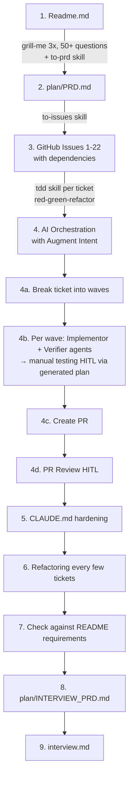
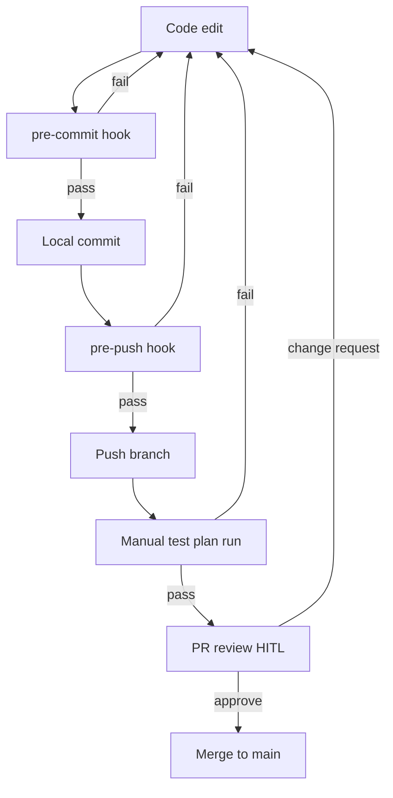
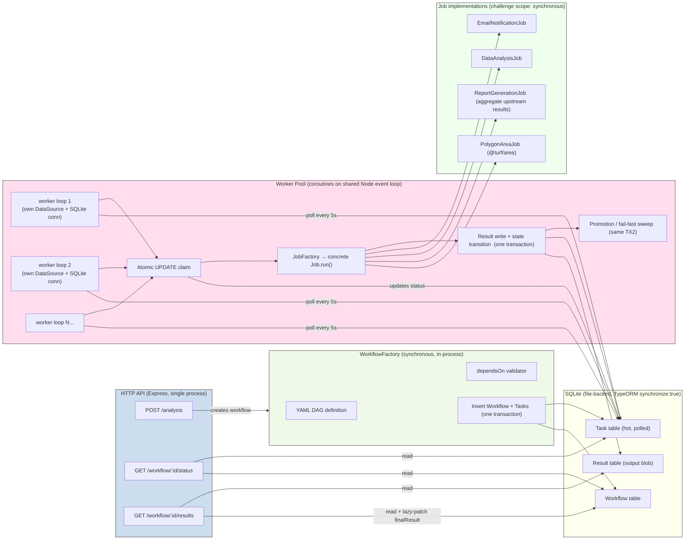
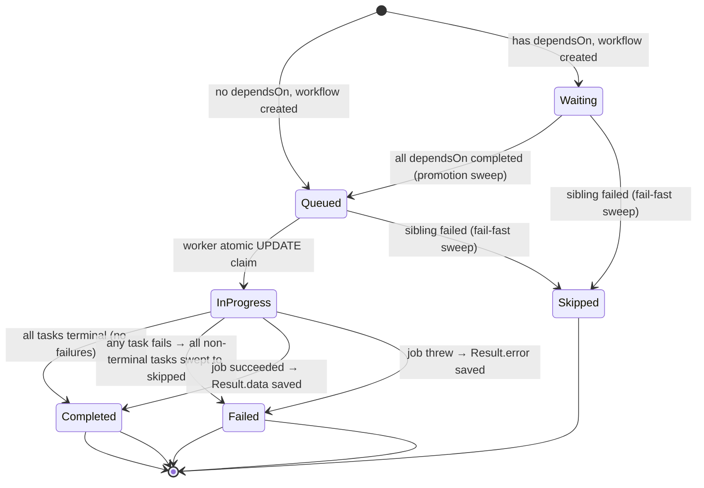

# Interviewer Readme

This coding challenge was solved end-to-end with AI using a structured Human-in-the-Loop (HITL) approach: PRD grilling → ticketed TDD → manual verification → review.

This document covers:

1. **How to verify each of the six README requirements** — one shell script (and one npm command) per happy/sad path, plus rationale files that explain what each script proves.
2. **The pragmatic design decisions** made along the way, each documenting the chosen *challenge-scope* solution alongside the *production-grade* alternative.

## 1. Orientation

| Path | Purpose |
| --- | --- |
| Readme.md | Original challenge brief (unmodified). |
| plan/PRD.md | Locked product spec — every requirement and assumption pinned with a production-grade alternative. |
| plan/INTERVIEW_PRD.md | Meta-spec for this document. |
| interview/manual_test_plan/ | Shell scripts (happy + sad per requirement) and rationale .md files. The verification surface for §4. |
| interview/archive/ | Long-form rationale and pre-rebuild material. Linked from §5 design decisions. |
| tests/ | Vitest suite (135 tests), one folder per README requirement. |
| npm run manual-test:all | Run every happy + sad shell script sequentially. Per-script commands also exist (see §4). |
| npm test | Run the full Vitest suite. |

## 2. Planning Process and Execution

GitHub issues: [hancrafted/async-worfklow-backend-challenge/issues](https://github.com/hancrafted/async-worfklow-backend-challenge/issues).

## 3. Harness

Layered Husky hooks gate every code edit before it reaches `main`. Both hooks are unbypassable — `--no-verify` is forbidden in `CLAUDE.md` and was verified during Task 0.

| Gate | What runs |
| --- | --- |
| .husky/pre-commit | ESLint + tsc --noEmit + vitest related --run against staged *.ts only. Fast enough to keep auto-commit cheap on doc-only edits and atomic commits cheap on code edits. ESLint enforces strict Clean Code-style limits — complexity ≤ 10, function ≤ 80 lines, file ≤ 350 lines, depth ≤ 4, params ≤ 4 — plus type-checked async correctness (no-floating-promises, no-misused-promises, await-thenable). |
| .husky/pre-push | Full npm test suite plus lint. |
| Manual test plan | Exercises the real HTTP server end-to-end (see §4). |
| PR review (HITL) | Final human checkpoint before merge. |

## 4. Manual verification of requirements

Verification uses simple shell scripts under `interview/manual_test_plan/` that exercise the live HTTP server and read task progress directly from the SQLite database via `sqlite3`. Each script prints `[PASS]`/`[FAIL]` lines and exits non-zero on failure.

The §03a workflow chains **over 20 interdependent tasks** through a `dependsOn` graph. This deliberately stresses coroutine concurrency across the per-worker SQLite DataSources — multiple workers claim and advance ready tasks in parallel while parents block dependents until complete.

> Prerequisite: sudo apt-get update && sudo apt-get install -y sqlite3 if sqlite3 is not present (e.g. codesandbox).

**Running the scripts via npm.** Each shell script is wired as an npm script for convenience:

- `npm run manual-test:all` — run every happy + sad script sequentially.
- `npm run manual-test:NN-<name>:happy` / `:sad` — run one script. For example: `npm run manual-test:01-polygon-area:happy`.

Direct `bash interview/manual_test_plan/<script>.sh` invocation also works. See `package.json` `scripts` for the full list.

| README req | Rationale | Happy | Sad | What it asserts |
| --- | --- | --- | --- | --- |
| §1 PolygonAreaJob | 01_polygon-area.md | 01_polygon-area_happy.sh | 01_polygon-area_sad.sh | Job calculates @turf/area and persists it on Result.data keyed off Task.resultId (happy); malformed GeoJSON marks the task failed with structured Result.error and a stack truncated to ≤10 lines (sad). |
| §2 ReportGenerationJob | 02_report-generation.md | 02_report-generation_happy.sh | 02_report-generation_sad.sh | Report aggregates upstream outputs into { workflowId, tasks[{stepNumber,taskType,output}], finalReport } with no taskId in the payload (happy); a corrupted upstream Result.data row makes the report job fail without breaking the workflow's terminal write (sad). |
| §3 Workflow YAML dependsOn | 03a_workflow-yaml-dependson.md | 03a_workflow-yaml-dependson_happy.sh | — see tests/03-interdependent-tasks/ | Workflow created from a multi-step YAML resolves dependsOn step numbers to UUIDs in a single transactional save; dependents stay waiting until parents complete. Sad-path validation (cycles, self-deps, missing refs, duplicate stepNumbers) is asserted by the integration suite. |
| §4 Workflow.finalResult | 04_workflow-final-result.md | 04_workflow-final-result_happy.sh | 04_workflow-final-result_sad.sh | finalResult is written eagerly inside the post-task transaction that takes the workflow terminal, with { workflowId, tasks[], failedAtStep? } shape and the conditional-UPDATE idempotency guard (happy); a failing first task closes the workflow as failed and finalResult.failedAtStep matches the failing step (sad). |
| §5 GET /workflow/:id/status | 05_workflow-status.md | 05_workflow-status_happy.sh | 05_workflow-status_sad.sh | Status response carries { workflowId, status, completedTasks, totalTasks, tasks[{stepNumber,taskType,status,dependsOn,failureReason?}] }; dependsOn is translated from internal UUIDs to public stepNumbers (happy); unknown id returns 404 { error: "WORKFLOW_NOT_FOUND" } (sad). |
| §6 GET /workflow/:id/results | 06_workflow-results.md | 06_workflow-results_happy.sh | 06_workflow-results_sad.sh | Completed workflow returns 200 { workflowId, status:"completed", finalResult } with the lazy-patch path covered if finalResult IS NULL at read time (happy); failed terminal returns 400 { error: "WORKFLOW_FAILED" } per Issue #22 strict policy and unknown id returns 404 (sad). |

For deeper plumbing — fixtures, helper signatures, archived per-task notes — see `interview/manual_test_plan/README.md`.

## 5. Design decisions

The five entries below are the calls most likely to draw pushback. Each covers *what was done* / *why* / *production-grade alternative*. Complete trade-off bookkeeping (every per-task call) lives in `interview/archive/design_decisions.md`, with long-form rebuttals alongside.

### 5.1 No lease, no heartbeat on `in_progress` tasks

**What.** The atomic claim is a single `UPDATE tasks SET status = 'in_progress' WHERE taskId = ? AND status = 'queued'`. No `claimedAt`, no `leaseExpiresAt`, no heartbeat goroutine, no boot-time recovery sweep.

**Why.** The DB is reset on every boot (`synchronize: true` against a wiped file), so no stale `in_progress` rows exist to recover. The atomic claim plus per-job timeouts suffices at this scope. A lease without a heartbeat ages into the same problem — a stale row gets re-claimed by another worker mid-execution — without buying anything. Full four-layer rebuttal in `interview/archive/no-lease-and-heartbeat.md`.

**Production-grade.** Persistent DB + TypeORM migrations + boot-time recovery sweep resetting stale `in_progress` rows older than the worker heartbeat back to `queued`.

### 5.2 Worker-pool default journey: 3 → 1 → 3

**What.** `DEFAULT_WORKER_POOL_SIZE` evolved across three steps:

1. Shipped at original default of `3`.
2. *Temporarily pinned at 1* in Task 7 because the shared `AppDataSource` (one SQLite connection across every coroutine) could not host concurrent `BEGIN` / `SAVEPOINT typeorm_N` / `COMMIT` boundaries.
3. *Restored to 3* in Issue #17 after per-worker file-backed `DataSource` instances + WAL mode removed the shared-connection ceiling at the substrate level.

**Why.** Pinning to 1 against a known-unsafe substrate was pragmatic over shipping a latent crash surface. Fixing the substrate was the correct *next* step once the integration suite could reproduce the failure deterministically. The talking point is *iterative hardening*, not the pin. Full narrative in `interview/archive/design_decisions.md` under `§Task 7` and `§Issue #17`.

**Production-grade.** Same shape — per-worker DataSources are the production form. Horizontal scaling adds N processes / containers each running `startWorkerPool` independently.

### 5.3 Output stored on `Result`, not `Task`

**What.** Job output lives on `Result.data` keyed off `Task.resultId`. No `Task.output` column exists, despite README §1 stating *"save the result in the output field of the task."*

**Why.** `tasks` is the hot, polled table; outputs can be large JSON blobs and do not belong on every poll. The README phrase is interpreted as the *logical* output (Task → Result via `resultId`) — consistent with the `Result` entity already shipped. Full README-consistency argument in `interview/archive/no-task-output-column.md`.

**Production-grade.** Same shape; `Result` rows would later move to object storage keyed by `resultId` while `Task` stays in OLTP.

### 5.4 Coroutines on a shared event loop, not worker threads

**What.** `startWorkerPool` spawns N `runWorkerLoop(...)` coroutines on the **same event loop** (cooperative concurrency via `async`/`await`), not OS threads via `node:worker_threads`.

**Why.** The worker is I/O-bound — every interesting operation is a SQLite or HTTP roundtrip. Cooperative concurrency keeps a single transactional boundary per worker without serialization/deserialization overhead at the thread boundary. Full study guide (event loop, async/await, when to reach for threads) in `interview/archive/coroutine-vs-thread.md`.

**Production-grade.** Same shape until a CPU-bound job appears; at that point worker threads (or out-of-process job runners) are appropriate for that specific job, not the whole pool.

### 5.5 Strict `400 WORKFLOW_FAILED` on `/results` (Issue #22)

**What.** A `failed` terminal workflow returns `400 { error: "WORKFLOW_FAILED" }` from `GET /workflow/:id/results`, not `200` with the `finalResult` envelope. `completed` keeps `200`.

**Why.** The original Wave-3 shape was lenient (`200` for any terminal) on the rationale that `finalResult` carried meaningful failure info. Issue #22 reverted to the strict reading of README §6 (*"return a 400 response if the workflow is not yet completed"* — `failed` is "not completed"). Reasons:

1. Overloading `200` conflated two distinct outcomes.
2. Clients had to branch on `body.status` rather than HTTP status.
3. Failure detail still surfaces via `GET /workflow/:id/status`, the endpoint designed for progress and diagnostics.

Full Issue #22 trail in `interview/archive/design_decisions.md` under `§Task 6`.

**Production-grade.** Same — strict HTTP semantics scale better across caller boundaries than overloaded payloads.

## 5. System architecture

### 5.1 Component map

### 5.2 Task state transitions

