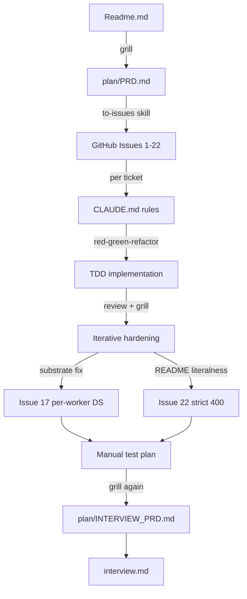
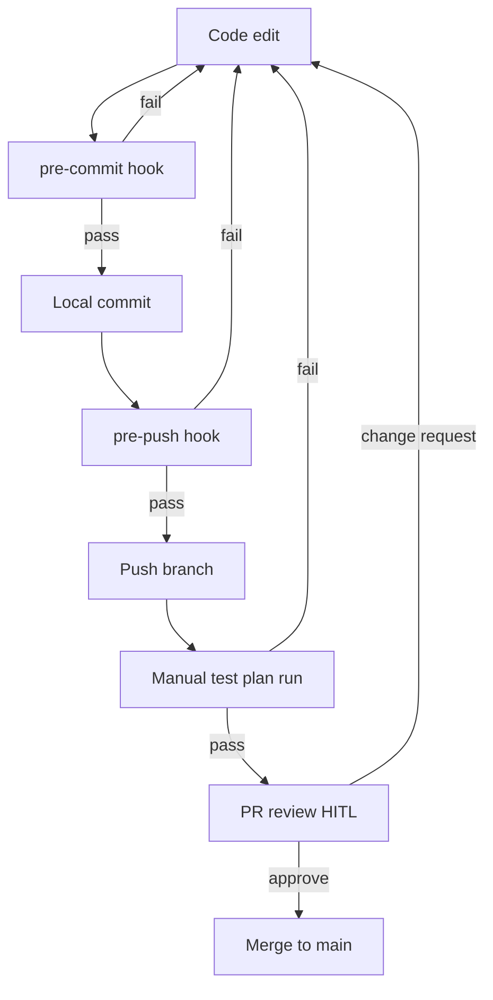

# Interview Entry Point

> **Reviewer entry point.** Open this document first. It provides a
> 5–10 minute orientation and links to executable evidence and prepared
> rationale for each design decision.
>
> Reference documents:
> 1. `Readme.md` — original challenge brief.
> 2. `plan/PRD.md` — locked product spec.
> 3. `plan/INTERVIEW_PRD.md` — meta-spec for this document.
> 4. `interview/archive/` — historical material; see `interview/archive/CLAUDE.md`.

## 1. Orientation

The repository implements the six README requirements (§1–§6) on top of
an in-process worker pool with per-worker SQLite DataSources:

1. `PolygonAreaJob` and `ReportGenerationJob`.
2. Interdependent tasks via a YAML `dependsOn` graph.
3. Aggregated `Workflow.finalResult`.
4. `/workflow/:id/status` and `/workflow/:id/results` endpoints.

**Skim-then-drill contract for this document:**

- **§2 Process** — tooling and gates, two diagrams (planning timeline +
  execution feedback loop). Covers *how* the work was decomposed.
- **§3 Verification** — six-row table mapping each README requirement to
  shell scripts and rationale `.md` files. Covers *how to run* the proofs.
- **§4 Design decisions** — six narrative entries plus a pushback →
  defense-file table. Covers specific design calls without requiring a
  read of the full 230-line `design_decisions.md`.

**Backing trees:**

- `Readme.md` — original challenge brief (unmodified).
- `plan/PRD.md` — locked product requirements.
- `plan/INTERVIEW_PRD.md` — locked spec for this document.
- `interview/manual_test_plan/` — `_lib.sh` + 11 happy/sad shell scripts
  + 6 rationale `.md` files (one per requirement).
- `interview/archive/` — pre-rebuild files, preserved for audit. Per
  `archive/CLAUDE.md`, do not cite as current state.
- `tests/` — Vitest suite (135 tests), one folder per requirement.

## 2. Process

### 2.1 Planning timeline

Decomposition is top-down:

1. `Readme.md` was processed through a grilling session into `plan/PRD.md`
   (303 lines; every assumption pinned with a *production-grade alternative*).
2. The `to-issues` skill broke the PRD into 22 GitHub issues, one TDD
   ticket each.
3. `CLAUDE.md` codifies project rules: transactions wrap multi-row writes,
   ENUMs replace magic strings, no `--no-verify`, manual `drainWorker`
   over fake timers, one commit per task in conventional-commit form.
4. Each ticket was implemented with the `tdd` skill (red → green →
   refactor), reviewed via HITL, and committed individually. The git log
   doubles as a process audit.

Two post-implementation grills produced follow-up issues:

- **Issue #17** — worker-pool default journey. Shipped pragmatically at
  `1` against a shared SQLite connection, then fixed the substrate with
  per-worker DataSources + WAL to restore the production default of `3`.
- **Issue #22** — reverted the lenient `200`-for-failed `/results` policy
  to the strict README-literal `400 WORKFLOW_FAILED`.

The same grilling discipline produced `plan/INTERVIEW_PRD.md`, which
drove this document.

### 2.2 Execution feedback-loop

Quality gates are layered Husky hooks (`.husky/pre-commit`,
`.husky/pre-push`):

1. **`pre-commit`** — ESLint + `tsc --noEmit` + `vitest related --run`
   against staged `*.ts` only. Fast enough to keep auto-commit cheap on
   doc-only edits and atomic commits cheap on code edits.
2. **`pre-push`** — full `npm test` suite plus lint.
3. Both hooks are unbypassable. `--no-verify` is forbidden in `CLAUDE.md`
   and was verified during Task 0.

HITL checkpoints sit at PR review and at the manual test plan run. The
manual test plan exercises the real HTTP server end-to-end with the same
shapes a caller would see — a documentation-stays-accurate gate that the
automated tests cannot provide.

## 3. Verification

> Prerequisite: `sudo apt-get update && sudo apt-get install -y sqlite3`
> if `sqlite3` is not present (e.g. codesandbox).

The verification surface lives in `interview/manual_test_plan/`:

1. One happy script per README requirement.
2. One sad script per requirement, except §03a — its sad-path coverage
   lives in `tests/03-interdependent-tasks/`.
3. Six rationale `.md` files explaining *what each script proves* and
   *what to look for in the output*, without restating the
   curl/sqlite/jq plumbing.
4. All scripts source `_lib.sh` for shared helpers (`require_server`,
   `post_analysis`, `wait_terminal`, `assert_*`, `summarize`, fixtures).

**Script contract** (locked in `plan/INTERVIEW_PRD.md` Round-10 grill):

- Each assertion prints `[PASS]` or `[FAIL]` plus the evidence checked.
  Scripts end with `summarize` and exit non-zero on any failure, giving
  a one-glance batch verdict.
- **Two-terminal pattern** (Q6) — Terminal A runs `npm start`; Terminal
  B runs the script(s). No script manages server lifecycle. Unreachable
  `:3000` triggers an actionable error from `_lib.sh::require_server`.
- **WorkflowId-scoped hermeticity** (Q7) — each script captures its own
  `$WORKFLOW_ID` and filters every SQL/HTTP assertion by it. Sad scripts
  that mutate the DB revert via `trap EXIT`. No global counts; scripts
  run in any order against a shared server.

**Running the scripts via npm.** Each shell script is wired as an npm
script for convenience:

- `npm run manual-test:all` — run every happy + sad script sequentially.
- `npm run manual-test:NN-<name>:happy` / `:sad` — run one script. For
  example: `npm run manual-test:01-polygon-area:happy`.

Direct `bash interview/manual_test_plan/<script>.sh` invocation also
works. See `package.json` `scripts` for the full list.

| README req | Rationale | Happy | Sad | What it asserts |
|---|---|---|---|---|
| §1 PolygonAreaJob | [`01_polygon-area.md`](./interview/manual_test_plan/01_polygon-area.md) | `01_polygon-area_happy.sh` | `01_polygon-area_sad.sh` | Job calculates `@turf/area` and persists it on `Result.data` keyed off `Task.resultId` (happy); malformed GeoJSON marks the task `failed` with structured `Result.error` and a stack truncated to ≤10 lines (sad). |
| §2 ReportGenerationJob | [`02_report-generation.md`](./interview/manual_test_plan/02_report-generation.md) | `02_report-generation_happy.sh` | `02_report-generation_sad.sh` | Report aggregates upstream outputs into `{ workflowId, tasks[{stepNumber,taskType,output}], finalReport }` with **no `taskId`** in the payload (happy); a corrupted upstream `Result.data` row makes the report job fail without breaking the workflow's terminal write (sad). |
| §3 Workflow YAML `dependsOn` | [`03a_workflow-yaml-dependson.md`](./interview/manual_test_plan/03a_workflow-yaml-dependson.md) | `03a_workflow-yaml-dependson_happy.sh` | — see [`tests/03-interdependent-tasks/`](./tests/03-interdependent-tasks/) | Workflow created from a multi-step YAML resolves `dependsOn` step numbers to UUIDs in a single transactional save; dependents stay `waiting` until parents complete. Sad-path validation (cycles, self-deps, missing refs, duplicate stepNumbers) is asserted by the integration suite. |
| §4 `Workflow.finalResult` | [`04_workflow-final-result.md`](./interview/manual_test_plan/04_workflow-final-result.md) | `04_workflow-final-result_happy.sh` | `04_workflow-final-result_sad.sh` | `finalResult` is written eagerly inside the post-task transaction that takes the workflow terminal, with `{ workflowId, tasks[], failedAtStep? }` shape and the conditional-UPDATE idempotency guard (happy); a failing first task closes the workflow as `failed` and `finalResult.failedAtStep` matches the failing step (sad). |
| §5 `GET /workflow/:id/status` | [`05_workflow-status.md`](./interview/manual_test_plan/05_workflow-status.md) | `05_workflow-status_happy.sh` | `05_workflow-status_sad.sh` | Status response carries `{ workflowId, status, completedTasks, totalTasks, tasks[{stepNumber,taskType,status,dependsOn,failureReason?}] }`; `dependsOn` is translated from internal UUIDs to public `stepNumber`s (happy); unknown id returns `404 { error: "WORKFLOW_NOT_FOUND" }` (sad). |
| §6 `GET /workflow/:id/results` | [`06_workflow-results.md`](./interview/manual_test_plan/06_workflow-results.md) | `06_workflow-results_happy.sh` | `06_workflow-results_sad.sh` | Completed workflow returns `200 { workflowId, status:"completed", finalResult }` with the lazy-patch path covered if `finalResult IS NULL` at read time (happy); failed terminal returns `400 { error: "WORKFLOW_FAILED" }` per Issue #22 strict policy and unknown id returns `404` (sad). |

For deeper plumbing — fixtures, helper signatures, archived per-task
notes — see [`interview/manual_test_plan/README.md`](./interview/manual_test_plan/README.md).

## 4. Design decisions

The six entries below are the calls most likely to draw pushback. Each
covers *what was done* / *why* / *production-grade alternative*.
Complete trade-off bookkeeping (every per-task call) lives in
[`interview/archive/design_decisions.md`](./interview/archive/design_decisions.md),
with long-form rebuttals alongside.

### 4.1 No lease, no heartbeat on `in_progress` tasks (Tier A)

**What.** The atomic claim is a single `UPDATE tasks SET status =
'in_progress' WHERE taskId = ? AND status = 'queued'`. No `claimedAt`,
no `leaseExpiresAt`, no heartbeat goroutine, no boot-time recovery
sweep.

**Why.** The DB is reset on every boot (`synchronize: true` against a
wiped file), so no stale `in_progress` rows exist to recover. The atomic
claim plus per-job timeouts suffices at this scope. A lease without a
heartbeat ages into the same problem — a stale row gets re-claimed by
another worker mid-execution — without buying anything. Full four-layer
rebuttal in
[`interview/archive/no-lease-and-heartbeat.md`](./interview/archive/no-lease-and-heartbeat.md).

**Production-grade.** Persistent DB + TypeORM migrations + boot-time
recovery sweep resetting stale `in_progress` rows older than the worker
heartbeat back to `queued`.

### 4.2 Worker-pool default journey: 3 → 1 → 3 (Tier A)

**What.** `DEFAULT_WORKER_POOL_SIZE` evolved across three steps:

1. Shipped at original default of `3`.
2. *Temporarily pinned at 1* in Task 7 because the shared
   `AppDataSource` (one SQLite connection across every coroutine) could
   not host concurrent `BEGIN` / `SAVEPOINT typeorm_N` / `COMMIT`
   boundaries.
3. *Restored to 3* in Issue #17 after per-worker file-backed
   `DataSource` instances + WAL mode removed the shared-connection
   ceiling at the substrate level.

**Why.** Pinning to 1 against a known-unsafe substrate was pragmatic
over shipping a latent crash surface. Fixing the substrate was the
correct *next* step once the integration suite could reproduce the
failure deterministically. The talking point is *iterative hardening*,
not the pin. Full narrative in
[`interview/archive/design_decisions.md`](./interview/archive/design_decisions.md)
under `§Task 7` and `§Issue #17`.

**Production-grade.** Same shape — per-worker DataSources are the
production form. Horizontal scaling adds N processes / containers each
running `startWorkerPool` independently.

### 4.3 Output stored on `Result`, not `Task` (Tier A)

**What.** Job output lives on `Result.data` keyed off `Task.resultId`.
No `Task.output` column exists, despite Readme §1 stating *"save the
result in the output field of the task."*

**Why.** `tasks` is the hot, polled table; outputs can be large JSON
blobs and do not belong on every poll. The README phrase is interpreted
as the *logical* output (Task → Result via `resultId`) — consistent with
the `Result` entity already shipped. Full README-consistency argument in
[`interview/archive/no-task-output-column.md`](./interview/archive/no-task-output-column.md).

**Production-grade.** Same shape; `Result` rows would later move to
object storage keyed by `resultId` while `Task` stays in OLTP.

### 4.4 Coroutines on a shared event loop, not worker threads (Tier A)

**What.** `startWorkerPool` spawns N `runWorkerLoop(...)` coroutines on
the **same event loop** (cooperative concurrency via `async`/`await`),
not OS threads via `node:worker_threads`.

**Why.** The worker is I/O-bound — every interesting operation is a
SQLite or HTTP roundtrip. Cooperative concurrency keeps a single
transactional boundary per worker without serialization/deserialization
overhead at the thread boundary. Full study guide (event loop,
async/await, when to reach for threads) in
[`interview/archive/coroutine-vs-thread.md`](./interview/archive/coroutine-vs-thread.md).

**Production-grade.** Same shape until a CPU-bound job appears; at
that point worker threads (or out-of-process job runners) are
appropriate for that specific job, not the whole pool.

### 4.5 Strict `400 WORKFLOW_FAILED` on `/results` (Issue #22) (Tier A)

**What.** A `failed` terminal workflow returns `400 { error:
"WORKFLOW_FAILED" }` from `GET /workflow/:id/results`, not `200` with
the `finalResult` envelope. `completed` keeps `200`.

**Why.** The original Wave-3 shape was lenient (`200` for any terminal)
on the rationale that `finalResult` carried meaningful failure info.
Issue #22 reverted to the strict reading of Readme §6 (*"return a 400
response if the workflow is not yet completed"* — `failed` is "not
completed"). Reasons:

1. Overloading `200` conflated two distinct outcomes.
2. Clients had to branch on `body.status` rather than HTTP status.
3. Failure detail still surfaces via `GET /workflow/:id/status`, the
   endpoint designed for progress and diagnostics.

Full Issue #22 trail in
[`interview/archive/design_decisions.md`](./interview/archive/design_decisions.md)
under `§Task 6`.

**Production-grade.** Same — strict HTTP semantics scale better across
caller boundaries than overloaded payloads.

### 4.6 Eager `finalResult` write + lazy patch on `/results` read (Tier B)

**What.** `finalResult` handling has two paths:

1. **Eager write.** Synthesized and written inside the post-task
   transaction that takes the workflow terminal, guarded by
   `WHERE finalResult IS NULL`.
2. **Lazy patch.** If a terminal workflow has `finalResult IS NULL` at
   `/results` read time (rare race or pre-Wave-1 row), the read handler
   computes and persists it on the fly under the same idempotent guard
   via `applyLazyFinalResultPatch(...)`, reusing
   `synthesizeFinalResult(...)` verbatim — single source of truth for
   the payload shape.

The query handler never advances workflow lifecycle; lifecycle flips
remain exclusively the runner's responsibility.

**Why.** Eager-write keeps `/results` a pure read on the happy path (no
synthesis cost per call). The lazy patch is defence-in-depth against
the race where a worker crashes between the status flip and the
`finalResult` write.

**Production-grade.** Emit a domain event (`workflow.finalized`) when
`finalResult` is written; downstream consumers subscribe instead of
polling.

### 4.7 Pushback → defense file

| Pushback | Prepared defense |
|---|---|
| "Where's the lease / heartbeat / claim recovery?" | [`interview/archive/no-lease-and-heartbeat.md`](./interview/archive/no-lease-and-heartbeat.md) |
| "Readme §1 says save to `Task.output` — why no column?" | [`interview/archive/no-task-output-column.md`](./interview/archive/no-task-output-column.md) |
| "Why coroutines on the event loop instead of `worker_threads`?" | [`interview/archive/coroutine-vs-thread.md`](./interview/archive/coroutine-vs-thread.md) |
| "Why did `DEFAULT_WORKER_POOL_SIZE` flip 3 → 1 → 3?" | [`interview/archive/design_decisions.md`](./interview/archive/design_decisions.md) §Task 7 + §Issue #17 |
| "`/results` returning `400` for `failed` — that's an error code for a known outcome, no?" | [`interview/archive/design_decisions.md`](./interview/archive/design_decisions.md) §Task 6 (Issue #22 supersession block) |
| "Why fail-fast over continue-on-error?" | [`interview/archive/design_decisions.md`](./interview/archive/design_decisions.md) §Task 3 |
| "Why doesn't fail-fast cancel `in_progress` siblings?" | [`interview/archive/design_decisions.md`](./interview/archive/design_decisions.md) §Task 3b-ii Wave 3 |
| "Why is the report job's payload missing the README-example `taskId` field?" | [`interview/archive/design_decisions.md`](./interview/archive/design_decisions.md) §Task 2 + §Decision 4 / US16 |
| "Why is `example_workflow.yml` not exercising `reportGeneration`?" | [`interview/archive/design_decisions.md`](./interview/archive/design_decisions.md) §Task 2 (last entry) |
| "Why no graceful shutdown / SIGTERM drain?" | [`interview/archive/design_decisions.md`](./interview/archive/design_decisions.md) §General Assumptions |
