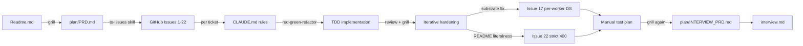
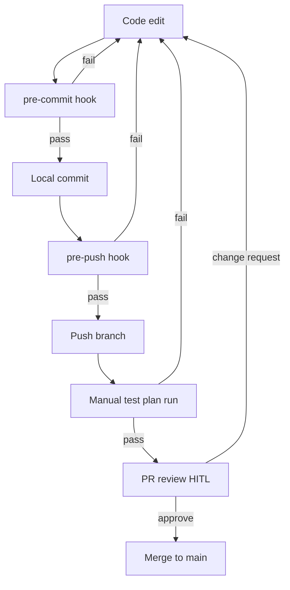

# Interview Entry Point

> **For the reviewer.** This is the single document I want you to open
> first. It orients you in 5–10 minutes, then points at the executable
> evidence and the prepared rationale for every design call I expect to
> get grilled on. The original challenge brief is `Readme.md`; the locked
> product spec is `plan/PRD.md`; the meta-spec for *this* document is
> `plan/INTERVIEW_PRD.md`. Everything under `interview/archive/` is
> historical — see `interview/archive/CLAUDE.md`.

## 1. Orientation

This repo implements the six README requirements (§1–§6) — two new jobs
(`PolygonAreaJob`, `ReportGenerationJob`), interdependent tasks via a YAML
`dependsOn` graph, an aggregated `Workflow.finalResult`, and the
`/workflow/:id/status` and `/workflow/:id/results` endpoints — on top of
an in-process worker pool with per-worker SQLite DataSources.

The **skim-then-drill contract** for this document:

- **§2 How I worked** — process and tooling, two diagrams (planning
  timeline + execution feedback-loop). Read this if you want to evaluate
  *how* the work was decomposed and gated.
- **§3 How to verify each requirement** — a six-row table mapping each
  README requirement to the shell script(s) and rationale `.md` that
  prove it. Read this if you want to *run* the verification yourself.
- **§4 Design decisions worth defending** — six narrative entries plus a
  pushback → defense-file table. Read this if you want to grill me on a
  specific call without crawling 230 lines of `design_decisions.md`.

Backing trees:
- `Readme.md` — original challenge brief (unmodified).
- `plan/PRD.md` — locked product requirements.
- `plan/INTERVIEW_PRD.md` — locked spec for the interview-doc rebuild
  this file is part of.
- `interview/manual_test_plan/` — `_lib.sh` + 11 happy/sad shell scripts
  + 6 rationale `.md` files (one per requirement).
- `interview/archive/` — every pre-rebuild file, preserved for audit.
  Per `archive/CLAUDE.md` do not cite anything in here as the current
  state.
- `tests/` — Vitest suite (135 tests), one folder per requirement.

## 2. How I worked

### 2.1 Planning timeline

Decomposition was deliberately top-down: the original `Readme.md` went
through an intensive grilling session that produced `plan/PRD.md` (303
lines, every assumption pinned with a *production-grade alternative*).
The `to-issues` skill broke the PRD into 22 GitHub issues sized for one
TDD ticket each. `CLAUDE.md` codifies the project rules (transactions
wrap multi-row writes, ENUMs replace magic strings, no `--no-verify`,
manual `drainWorker` over fake timers, one commit per task in
conventional-commit form). Each ticket was implemented with the `tdd`
skill (red → green → refactor), reviewed via HITL, and committed
individually so the git log doubles as a process audit. Two
post-implementation grills produced **Issue #17** (the worker-pool
default journey — shipped pragmatic `1` against a shared SQLite
connection, then fixed the substrate with per-worker DataSources + WAL
to restore the production default of `3`) and **Issue #22** (reverted
the lenient `200`-for-failed `/results` policy to the strict
README-literal `400 WORKFLOW_FAILED`). The same grilling discipline
produced `plan/INTERVIEW_PRD.md`, which in turn drove this document.

### 2.2 Execution feedback-loop

Quality gates are layered Husky hooks (see `.husky/pre-commit` and
`.husky/pre-push`). **`pre-commit`** runs ESLint + `tsc --noEmit` +
`vitest related --run` against staged `*.ts` only — fast enough that
auto-commit on doc-only edits stays cheap, fast enough on code edits to
not discourage atomic commits. **`pre-push`** runs the full `npm test`
suite plus lint. Both hooks are unbypassable for both humans and agents
— `--no-verify` is forbidden in `CLAUDE.md` and was verified during
Task 0. The HITL checkpoints sit at PR review time and at the manual
test plan run; the manual test plan is the documentation-stays-accurate
gate that the automated tests cannot give you, because it exercises the
real HTTP server end-to-end with the same shapes a caller would see.

## 3. How to verify each requirement

> Run `sudo apt-get update && sudo apt-get install -y sqlite3` if sqlite3 is not installed in codesandbox

The verification surface is `interview/manual_test_plan/` — one happy
script per README requirement, plus one sad script per requirement
*except* §03a (whose sad-path coverage lives in
`tests/03-interdependent-tasks/` rather than as a shell script). Six
rationale `.md` files explain *what each script proves* and *what to
look for in the output* without re-printing the curl/sqlite/jq plumbing.
All scripts source `_lib.sh` for shared helpers (`require_server`,
`post_analysis`, `wait_terminal`, `assert_*`, `summarize`, fixtures).

**Script contract** (locked in `plan/INTERVIEW_PRD.md` Round-10 grill):

- Each assertion prints a `[PASS]` or `[FAIL]` line plus the evidence it
  is checking. The script ends with `summarize` and exits non-zero if
  any assertion failed, so a batch run gives a one-glance smoke verdict.
- **Two-terminal pattern** (Q6) — Terminal A runs `npm start`; Terminal
  B runs the script(s). No script manages server lifecycle. If `:3000`
  is unreachable, `_lib.sh::require_server` prints an actionable error.
- **WorkflowId-scoped hermeticity** (Q7) — every script captures its own
  `$WORKFLOW_ID` and filters every SQL/HTTP assertion by it. Sad scripts
  that mutate the DB revert via `trap EXIT`. No script reads global
  counts; scripts may run in any order against a shared server.

| README req | Rationale | Happy | Sad | What it asserts |
|---|---|---|---|---|
| §1 PolygonAreaJob | [`01_polygon-area.md`](./interview/manual_test_plan/01_polygon-area.md) | `01_polygon-area_happy.sh` | `01_polygon-area_sad.sh` | Job calculates `@turf/area` and persists it on `Result.data` keyed off `Task.resultId` (happy); malformed GeoJSON marks the task `failed` with structured `Result.error` and a stack truncated to ≤10 lines (sad). |
| §2 ReportGenerationJob | [`02_report-generation.md`](./interview/manual_test_plan/02_report-generation.md) | `02_report-generation_happy.sh` | `02_report-generation_sad.sh` | Report aggregates upstream outputs into `{ workflowId, tasks[{stepNumber,taskType,output}], finalReport }` with **no `taskId`** in the payload (happy); a corrupted upstream `Result.data` row makes the report job fail without breaking the workflow's terminal write (sad). |
| §3 Workflow YAML `dependsOn` | [`03a_workflow-yaml-dependson.md`](./interview/manual_test_plan/03a_workflow-yaml-dependson.md) | `03a_workflow-yaml-dependson_happy.sh` | — see [`tests/03-interdependent-tasks/`](./tests/03-interdependent-tasks/) | Workflow created from a multi-step YAML resolves `dependsOn` step numbers to UUIDs in a single transactional save; dependents stay `waiting` until parents complete. Sad-path validation (cycles, self-deps, missing refs, duplicate stepNumbers) is asserted by the integration suite. |
| §4 `Workflow.finalResult` | [`04_workflow-final-result.md`](./interview/manual_test_plan/04_workflow-final-result.md) | `04_workflow-final-result_happy.sh` | `04_workflow-final-result_sad.sh` | `finalResult` is written eagerly inside the post-task transaction that takes the workflow terminal, with `{ workflowId, tasks[], failedAtStep? }` shape and the conditional-UPDATE idempotency guard (happy); a failing first task closes the workflow as `failed` and `finalResult.failedAtStep` matches the failing step (sad). |
| §5 `GET /workflow/:id/status` | [`05_workflow-status.md`](./interview/manual_test_plan/05_workflow-status.md) | `05_workflow-status_happy.sh` | `05_workflow-status_sad.sh` | Status response carries `{ workflowId, status, completedTasks, totalTasks, tasks[{stepNumber,taskType,status,dependsOn,failureReason?}] }`; `dependsOn` is translated from internal UUIDs to public `stepNumber`s (happy); unknown id returns `404 { error: "WORKFLOW_NOT_FOUND" }` (sad). |
| §6 `GET /workflow/:id/results` | [`06_workflow-results.md`](./interview/manual_test_plan/06_workflow-results.md) | `06_workflow-results_happy.sh` | `06_workflow-results_sad.sh` | Completed workflow returns `200 { workflowId, status:"completed", finalResult }` with the lazy-patch path covered if `finalResult IS NULL` at read time (happy); failed terminal returns `400 { error: "WORKFLOW_FAILED" }` per Issue #22 strict policy and unknown id returns `404` (sad). |

For deeper plumbing — fixtures, helper signatures, archived per-task
notes — see [`interview/manual_test_plan/README.md`](./interview/manual_test_plan/README.md).

## 4. Design decisions worth defending

Six entries below are the calls I most expect to get pushed on. Each
gives *what we did* / *why* / *production-grade alternative*. The full
trade-off bookkeeping (every per-task call, including the ones I am
*not* expecting to get grilled on) is in
[`interview/archive/design_decisions.md`](./interview/archive/design_decisions.md);
the long-form prepared rebuttals live alongside it.

### 4.1 No lease, no heartbeat on `in_progress` tasks (Tier A)

**What we did.** The atomic claim is a single `UPDATE tasks SET status =
'in_progress' WHERE taskId = ? AND status = 'queued'`. No `claimedAt`,
no `leaseExpiresAt`, no heartbeat goroutine, no boot-time recovery
sweep. **Why.** The DB is reset on every boot (`synchronize: true`
against a file we wipe), so there are no stale `in_progress` rows to
recover from. The atomic claim plus per-job timeouts is sufficient at
this scope; a lease without a heartbeat ages into the same problem
(stale row gets re-claimed by another worker mid-execution) without
buying anything. Full four-layer rebuttal in
[`interview/archive/no-lease-and-heartbeat.md`](./interview/archive/no-lease-and-heartbeat.md).
**Production-grade.** Persistent DB + TypeORM migrations + boot-time
recovery sweep that resets stale `in_progress` rows older than the
worker heartbeat back to `queued`.

### 4.2 Worker-pool default journey: 3 → 1 → 3 (Tier A)

**What we did.** `DEFAULT_WORKER_POOL_SIZE` shipped at the original
default of `3`, was *temporarily pinned at 1* in Task 7 because the
shared `AppDataSource` (one SQLite connection across every coroutine)
could not host concurrent `BEGIN` / `SAVEPOINT typeorm_N` / `COMMIT`
boundaries, then was *restored to 3* in Issue #17 after per-worker
file-backed `DataSource` instances + WAL mode removed the
shared-connection ceiling at the substrate level. **Why.** Pinning to 1
against a known-unsafe substrate was the pragmatic choice over shipping
a latent crash surface; fixing the substrate was the right *next* step
once the integration test suite could reproduce the failure
deterministically. The talking point is *iterative hardening*, not the
pin itself. Full narrative in
[`interview/archive/design_decisions.md`](./interview/archive/design_decisions.md)
under `§Task 7` and `§Issue #17`.
**Production-grade.** Same — per-worker DataSources are the production
shape; horizontal scaling adds N processes / containers each running
`startWorkerPool` independently.

### 4.3 Output stored on `Result`, not `Task` (Tier A)

**What we did.** Job output lives on `Result.data` keyed off
`Task.resultId`; there is no `Task.output` column even though Readme §1
says *"save the result in the output field of the task."* **Why.**
`tasks` is the hot, polled table; outputs can be large JSON blobs and
do not belong on every poll. The README phrase is read as the *logical*
output (Task → Result via `resultId`) — internally consistent with the
`Result` entity the codebase already ships. Full README-consistency
argument in
[`interview/archive/no-task-output-column.md`](./interview/archive/no-task-output-column.md).
**Production-grade.** Same shape; `Result` rows would later move to
object storage keyed by `resultId` while `Task` stays in OLTP.

### 4.4 Coroutines on a shared event loop, not worker threads (Tier A)

**What we did.** `startWorkerPool` spawns N `runWorkerLoop(...)`
coroutines on the **same event loop** (cooperative concurrency via
`async`/`await`), not OS threads via `node:worker_threads`. **Why.**
The worker is I/O-bound (every interesting operation is a SQLite or
HTTP roundtrip); cooperative concurrency keeps a single transactional
boundary per worker without serialization-deserialization overhead at
the thread boundary. Full study guide (event loop, async/await, when
to reach for threads) in
[`interview/archive/coroutine-vs-thread.md`](./interview/archive/coroutine-vs-thread.md).
**Production-grade.** Same shape until a CPU-bound job appears; at
that point worker threads (or out-of-process job runners) are
appropriate for that specific job, not the whole pool.

### 4.5 Strict `400 WORKFLOW_FAILED` on `/results` (Issue #22) (Tier A)

**What we did.** A `failed` terminal workflow returns `400 { error:
"WORKFLOW_FAILED" }` from `GET /workflow/:id/results` (not `200` with
the `finalResult` envelope). `completed` keeps `200`. **Why.** The
original Wave-3 shape was lenient (`200` for any terminal) under the
rationale that `finalResult` carried meaningful failure info. Issue #22
reverted to a strict reading of Readme §6 (*"return a 400 response if
the workflow is not yet completed"* — `failed` is "not completed")
because overloading `200` conflated two distinct outcomes and forced
clients to branch on `body.status` rather than HTTP status. Failure
detail still surfaces — operators read it from
`GET /workflow/:id/status`, which is the endpoint designed for
progress / diagnostics. Full Issue #22 trail in
[`interview/archive/design_decisions.md`](./interview/archive/design_decisions.md)
under `§Task 6`.
**Production-grade.** Same — strict HTTP semantics scale better across
caller boundaries than overloaded payloads.

### 4.6 Eager `finalResult` write + lazy patch on `/results` read (Tier B)

**What we did.** `finalResult` is synthesized and written *eagerly*
inside the post-task transaction that takes the workflow terminal,
guarded by `WHERE finalResult IS NULL`. If a terminal workflow somehow
has `finalResult IS NULL` when `/results` is read (rare race or
pre-Wave-1 row), the read handler computes and persists it on the fly
under the same idempotent guard via `applyLazyFinalResultPatch(...)`,
reusing `synthesizeFinalResult(...)` verbatim — single source of truth
for the payload shape. The query handler never advances workflow
lifecycle; lifecycle flips are exclusively the runner's responsibility.
**Why.** Eager-write keeps `/results` a pure read on the happy path
(no synthesis cost on every call); the lazy patch is a defence-in-depth
against the race where a worker crashes between the status flip and
the `finalResult` write.
**Production-grade.** Emit a domain event (`workflow.finalized`) when
`finalResult` is written; downstream consumers subscribe instead of
polling.

### 4.7 Pushback → defense file

| Pushback you might raise | Where the prepared defense lives |
|---|---|
| "Where's the lease / heartbeat / claim recovery?" | [`interview/archive/no-lease-and-heartbeat.md`](./interview/archive/no-lease-and-heartbeat.md) |
| "Readme §1 says save to `Task.output` — why no column?" | [`interview/archive/no-task-output-column.md`](./interview/archive/no-task-output-column.md) |
| "Why coroutines on the event loop instead of `worker_threads`?" | [`interview/archive/coroutine-vs-thread.md`](./interview/archive/coroutine-vs-thread.md) |
| "Why did `DEFAULT_WORKER_POOL_SIZE` flip 3 → 1 → 3?" | [`interview/archive/design_decisions.md`](./interview/archive/design_decisions.md) §Task 7 + §Issue #17 |
| "`/results` returning `400` for `failed` — that's an error code for a known outcome, no?" | [`interview/archive/design_decisions.md`](./interview/archive/design_decisions.md) §Task 6 (Issue #22 supersession block) |
| "Why fail-fast over continue-on-error?" | [`interview/archive/design_decisions.md`](./interview/archive/design_decisions.md) §Task 3 |
| "Why doesn't fail-fast cancel `in_progress` siblings?" | [`interview/archive/design_decisions.md`](./interview/archive/design_decisions.md) §Task 3b-ii Wave 3 |
| "Why is the report job's payload missing the README-example `taskId` field?" | [`interview/archive/design_decisions.md`](./interview/archive/design_decisions.md) §Task 2 + §Decision 4 / US16 |
| "Why is `example_workflow.yml` not exercising `reportGeneration`?" | [`interview/archive/design_decisions.md`](./interview/archive/design_decisions.md) §Task 2 (last entry) |
| "Why no graceful shutdown / SIGTERM drain?" | [`interview/archive/design_decisions.md`](./interview/archive/design_decisions.md) §General Assumptions |
